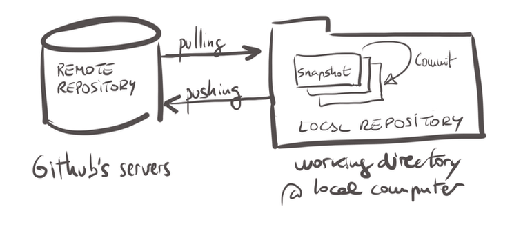
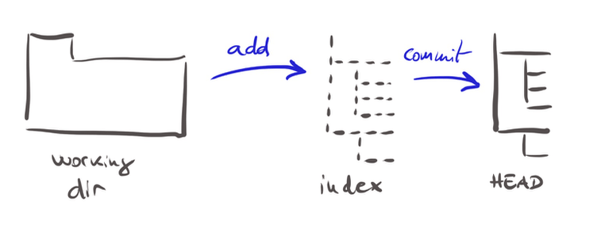
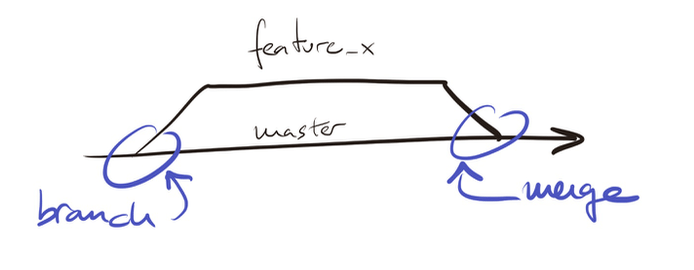
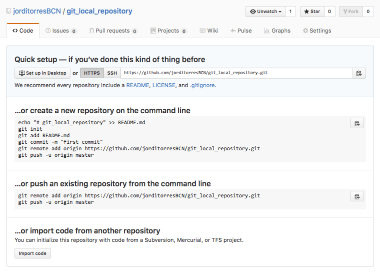
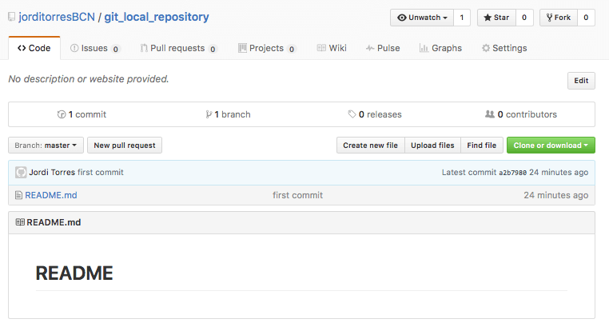

# Git and GitHub Quick Start

This hands-on quickstart guide is a "simple Beginner's guide" that provides a fast-paced introduction to the essential characteristics of `git`. It is intended for those students enrolled in Computer Science Masters' Courses who have no prior knowledge of git/Github, to help them learn the minimum required background knowledge necessary to follow the courses. The material has been written to provide a hands-on practice while the student explores new technical expertise. We recommend you to read this guide on a computer and try to complete all the exercises.


## Table of Contents

* [Getting Started](#started)
* [Getting Started with Git](#git)
    * [Installing git](#installing)
    * [git init](#init)
    * [Add & commit](#add)
    * [Branching](#branching)
* [Getting Started with GitHub](#github)
    * [Creating a GitHub account](#account)
    * [Connecting a local repository to a Github repository](#connecting)
    * [Branching](#branching2)
* [Git clone](#clone)
* [To go into more detail](#detail)
 

<a name="started"/>

## 1. Getting Started

[**Git**](https://git-scm.com/) is a free and open source distributed version control system (started in 2005 by Linus Torvald) designed to handle everything from small to extensive code projects. Using git, **users keep entire code files on their location machines**. However, git maintains a historical record of the files in your codebase, as well as manages workflows that allow teams of programmers to work together, allowing them to revert any changes and go back to a previous code version.  For this purpose git, stores the files into a shared repository being GitHub ([**G+**](https://github.com/)) a popular alternative. GitHub took the git program and connected the people and code over the web, creating an ecosystem and user interface for software projects that we can 'touch'. 


Before going deeper into the matter, it is important to clarify some central concepts:

- **Snapshot** is the way git keeps track of our code history recording what our files look like at a given point in time. We can decide when to take a snapshot and go back to visit any previous snapshot.

- **Commit** refers to the act of creating a snapshot. Mostly, a project in GitHub is made up of a bunch of commits. Basically, a commit contains three pieces of information: information about how the files changed from the previous snapshot, a reference to the commit that came before it (called the *parent commit*) and a hash code name to identify the commit.

- **Repository**, often shortened to **repo**, refers the collection of all the files, the history of these files and all the commits. A repository can live on our local machine, referenced as our **local repository**,  or on a remote on GitHub's server, named **remote repository**. 

- The action of downloading commits that don’t exist on our local repository from a remote repository is called **pulling** changes.  The process of adding our local changes to the remote repository is called **pushing** changes.





<a name="git"/>

## 2. Getting Started with Git

<a name="installing"/>

### 2.1. Installing git
To install git, you can visit the [git download page](https://git-scm.com/download) and run the installer program for your operating system.

You can verify that git is working from the command line:
```
$ git --version
```
You should view something like `git version 2.13.0`, that indicates the installed version.

In this hands-on quickstart guide, we will be using the command line to interact with git repositories. There are also graphical user interface applications, or GUI apps, available for Windows, Linux, and OSX. Using these apps, you can view and maintain your repositories.

<a name="init"/>

### 2.2. git init
To begin, let's create a new directory called `git_local_repository` and add a few files to it.

```
$ mkdir git_local_repository
$ cd git_local_repository
git_local_repository $ echo '# README #' > README.md
git_local_repository $ echo '# LICENSE #' > LICENSE.md
```

As an example, we created the files `README.md` and `LICENSE.md`, both usually included in the root directory of many open source projects. 

#### Markdown format

These particular files use the [markdown format](https://help.github.com/articles/getting-started-with-writing-and-formatting-on-github/) that allows us to create sophisticated formatting for your prose (and code on GitHub) with a simple syntax. For example:
- To create a heading, add one to six **#** symbols before your heading text. The number of # you use determines the size of the heading.
- To indicate emphasis with bold use \*\* before and after the selected text.
- To add emphasis using italics place \* before and after the selected text.
- You can quote text with a **\>**.
- You can call out code or a command within a sentence with single backticks **\`**. The text within the backticks will not be formatted.
- To format code or text into its distinct block, use triple backticks.
- We can create an inline link by wrapping link text in brackets **\[ \]**, and then enclosing the URL in parentheses **( )**. 
- We can make a list by preceding one or more lines of text with **-** or *. to show it ordered:  showing a number preceding each line.
- We can create a new paragraph by leaving a blank line between lines of text.

For more information, see Daring Fireball's ["Markdown Syntax"](https://daringfireball.net/projects/markdown/syntax#backslash).


Now we can create a local repository with the following command:
```
git_local_repository $ git init
```
We should see something like `Initialized empty Git repository in  git_local_repository/.git/`as an output indicating that we have created a new repository in your current directory. Internally a `.git` directory was added to the local directory as you can check with:


```
git_local_repository $ ls -a
.        ..        .git        LICENSE.md    README.md
```
That command changes the `.git` directory into a git repository. The `.git` *hidden* directory will contain all of the configuration and metadata necessary for git to keep track of our files and the changes that we'll make to them. 

Usually, we want to store our identity information to tell our name/email to all git repositories in our system, which will be applied to each future commit. Type the following text into the command line, replacing the shown identity with your own:

```
git_local_repository $ git config --global user.name "angeltoribio-UPC-BCN"
git_local_repository $ git config --global user.email angel.toribio@upc.edu
git_local_repository $ git config -l
```


After initializing a directory as a git repository, we can start issuing other git commands. **Warning, do not nest repositories!!!**.

<a name="add"/>

### 2.3. Add & commit

Your local repository consists of three "trees" maintained by git. The first one is your **_Working Directory_** which holds the actual file you are editing. The second one is the **_Index_** which acts as a staging area. Finally, the **_HEAD_** that points to the last commit you made.

You can propose file changes (add the file to the Index) using `git add <filename>`( or `git add *` ). That is the first step in the basic git workflow. To commit these changes use `git commit -m "Commit message"`. Now the file is committed to the HEAD of your local working directory (but not yet to your remote repository).



In our case we can execute:

```
git_local_repository $ git add README.md
git_local_repository $ git commit -m "first commit"
```

Notice that we do not add `LICENSE.md` file intentionally, to show the differences. Sometimes git repositories will have private data that you do not want to share (app configuration details with passwords and other confidential information). That is what the `.gitignore` file is for. That file is a list of filenames and/or directories that you do not want to be included in your repository. Git will then not allow you to add any of the files referenced in  the file `.gitignore` to your repository.


<a name="branching"/>

### 2.4. Branching
Branching is a powerful mechanism in any repository tool that allows developers to veer off into a tangential or experimental direction, without affecting the main codebase.

In git, a **branch** is a copy of all the files in your codebase. Each branch has an identifying name and its own set of versions or commits history. When you create a new repository, the default branch is called `master`. Even if you do not create any additional branches, you will be performing all git commands on a branch called `master` (being it the "default" branch).

To create a new branch, we **fork** it from an existing one, likely the `master` branch. Then we are immediately switched to the newly forked branch, and the future operations will act upon the new branch. The new experimental branch will keep all the historical changes of the master branch up to the point of the fork. That is, the two branches do not stay in sync automatically while going forward. In case we decide to discard that experimental branch, we can simply delete it. On the other hand, if we want to keep the code modifications we can **merge** the commits from the experimental branch into the `master` branch.



To create a new branch named "feature_x" and switch to it we use `git checkout -b feature_x`. To switch back to master
`git checkout master` and to delete the branch `git branch -d feature_x`. 

To merge another branch into your active branch (e.g., master), use `git merge <branch>`. Git tries to auto-merge changes.  Unfortunately (and obviously), this is not always possible and results in **_conflicts_**. You are responsible for solving these merging conflicts manually by editing the files reported by git. After fixing the conflicts, you will need to mark them as merged with `git add <filename>`. Before merging changes, you can also preview them by using `git diff <source_branch> <target_branch>`.

<a name="github"/>

## 3. Getting Started with GitHub

<a name="account"/>

### 3.1. Creating a GitHub account

[**Github**](https://github.com/) offers free accounts for users and organizations working on public and open source projects, as well as paid accounts that offer unlimited private repositories. GitHub has an [**Education Program**](https://education.github.com/) that includes very interesting perks. If you are a student, go and [**get the Student Developer Pack**](https://education.github.com/pack)!

Once you have your GitHub account set up, it is time to learn how to use it. Whenever you are logged in to the GitHub website, you will see a plus icon in the upper right corner. When you click on that, you will see a menu that includes a *New Repository* option. Click on the link. Choosing a repository name comes next (if we have spaces in our repo name, GitHub will automatically replace them with hyphens). 

In this hands-on quickstart guide, we are going to create a remote repository on GitHub where we can push the local repository that we previously created (our local and remote repos do not have to share the name). We can decide if our repo is public or private. 

The next important thing we need to look at is the *Initialize this repository with a README* check box. That is an essential step in creating our remote repo. If we check the box, it will automatically create and commit a *README file* in our remote repo. We will usually create our local repo first, so we will not check this box in this case (this is the case of our example in this hands-on quickstart guide).

<a name="connecting"/>

### 3.2. Connecting local repository to Github repository 

Now you should see instructions (similar to the following screenshot) on how to connect your local repository to your computer to the remote one you just created on GitHub. 




Looking at just the first option, the set of git commands that should look very familiar, we have already issued the first four commands. We only need to perform the last two commands to link our local repository with the remote one.

Remember that your changes are in the HEAD of your local working copy. To send those changes to your remote repository, you need to add it using `git remote add origin <server>`. Now we can push our changes to the selected remote server:

```
git_local_repository $ git remote add origin https://github.com/angeltoribio-UPC-BCN/git_local_repository.git
```
Before we move on, let's take a look at the command we just executed. The primary git command we issued is `git remote` to work with remote repositories. If we just typed `git remote` by itself, git will list all the remote repositories that your local repository knows about. If we pass additional sub-commands to the `git remote` command, we can further add, remove, and modify the remote GitHub repository that your local repository is linked to. The parameters `origin` and `https://github.com/angeltoribio-UPC-BCN/git_local_repository.git` refer to the remote repository. In particular `origin` is an alias that we use locally to interact with this remote repository and  `https://github.com/angeltoribio-UPC-BCN/git_local_repository.git` indicates the URL of the remote repository. If you open `.git/config` in a text editor, you will see how git stores the information we just added.

We are now ready to **push** our code to GitHub with:
```
git_local_repository $ git push -u origin master
```
Here, `origin` is the alias of remote repository indicated before and `master` indicates the remote repository branch.

If we have never pushed to GitHub before, we will now be seeing a login prompt, and we are required to introduce our GitHub username and password. If you are following along from the previous sections, your output should read, approximately, as follows:
```
Username for 'https://github.com': angeltoribio-UPC-BCN
Password for 'https://angeltoribio-UPC-BCN@github.com': 
Counting objects: 3, done.
Writing objects: 100% (3/3), 236 bytes | 0 bytes/s, done.
Total 3 (delta 0), reused 0 (delta 0)
To https://github.com/angeltoribio-UPC-BCN/git_local_repository.git
 * [new branch]      master -> master
Branch master set up to track remote branch master from origin.
```

After a successful login, we will view a message saying that our objects have been written. We will also see a message saying that we have set up our local master branch to track the remote master branch (thanks to the `-u` flag).


As a result we have in our remote GitHub account our files added with `git add`, in our case only `README.md`file.



Sometimes the code in our remote repository will contain commits that we do not have in your local repository (for example because we work inside a team or we made a change to a file directly at GitHub.com). In these situations, we will need to **pull** the commits from the remote repository into our local repository with the command:

```
git_local_repository $ git pull origin master
```


<a name="branching2"/>

### 3.3. Branching
It is important to be aware that branches can exist both locally and on remote repositories. A branch is not available to others unless you push the branch to your remote repository
`git push origin <branch>`. 

If you want to update your local repository to the newest commit, execute 
```
git_local_repository $ git pull
```
In your working directory to *fetch* and *merge* remote changes. To merge another branch into your active branch (e.g., master), use `git merge <branch>`. 

<a name="clone"/>

## 4. Git clone
So far, we have been talking about connecting an existing remote repository to an existing local repository. However, what if we do not have an existing local repository, and we just want to pull down all the contents from a remote repository? In this case, we can use `git clone`to make an exact clone of an existing remote repository in our local repository.  The git clone command has several options, but most of the time we will only consider its basic usage `git clone <remote_repository_url> <local_directory_path>`.

`git clone` is mainly used when we need to work with a remote repository and do not yet have a local repository created. That is the case of many of the hands-on guides and exercises suggested in this course. For this reason, we will use `git clone` in almost all laboratory hands-on sessions. For instance, assume that the documentation of today's hands-on session is at `https://github.com/angeltoribio-UPC-BCN/git_local_repository.git` (our today example).  Here is what it looks like in action:

```
$ pwd
/Users/angeltoribio
$ git clone https://github.com/angeltoribio-UPC-BCN/git_local_repository.git hands-on_lab
Cloning into 'hands-on_lab'...
remote: Counting objects: 3, done.
remote: Total 3 (delta 0), reused 3 (delta 0), pack-reused 0
Unpacking objects: 100% (3/3), done.
Checking connectivity... done.
$ ls
hands-on_lab
$ cd hands-on_lab/
hands-on_lab $ ls -a
.        ..        .git        README.md
hands-on_lab $ 
```
As you can see a new local git repository was created at a directory named `hands-on_lab`. All content from the remote repository `https://github.com/angeltoribio-UPC-BCN/git_local_repository.git` was downloaded into the newly created local repository. Finally, see that a "*remote*" was added to the local repository's configuration, pointing to the remote repository URL, aliased as `origin`. That offers the same result as issuing `git remote add origin https://github.com/angeltoribio-UPC-BCN/git_local_repository.git` from within the local repository directory.

<a name="detail"/>

## 5. To go into more detail
There are plenty of courses and tutorials available on the Internet regarding Git and GitHub. Here you can find just a few pointers:
- GITHUB https://try.github.io
- UDEMY https://www.udemy.com/courses/search/?q=github&src=sac&kw=git
- LYNDA https://www.lynda.com/GitHub-training-tutorials/1384-0.html

[GitHub cheat sheet](https://education.github.com/git-cheat-sheet-education.pdf)

An excellent book is the [Pro Git](https://git-scm.com/book) book, written by Scott Chacon and Ben Straub and published by Apress. It is available [here](https://git-scm.com/book) (pdf, epub, mobi, HTML). All content is licensed under the Creative Commons Attribution Non-Commercial Share Alike 3.0 license. Print versions of the book are available on [Amazon.com](https://www.amazon.com/Pro-Git-Scott-Chacon/dp/1484200772?ie=UTF8&camp=1789&creative=9325&creativeASIN=1430218339&linkCode=as2&tag=git-sfconservancy-20).

Now, we are ready to start a [new hands-on quickstart guide](./Python-Quick-Start.md). Enjoy!
