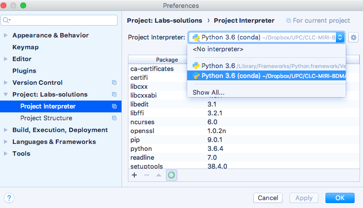

# Python Development Environment Quick Start

* [About this hands-on guide](#about)
* [Anaconda](#AnacondaChapter)
* [Downloading and installing Anaconda](#installing)
* [Managing environments](#managing)
* [New iPython notebook](#ipython)
* [Kernels for Python 2 and 3](#kernels)


<a name="about"/>
Until now we have discovered how to write our first program in Python and how to install the required environment.  Alternately, we can download and install an environment that can simplify package management and deployment (which also comes with pre-installed libraries). 

This hands-on guide is intended to be a "Simple Beginner’s guide" that provides a fast-paced introduction to the Python Development Environment [Anaconda](https://www.continuum.io/why-anaconda). Note that Python code in these hands-on guides uses version 3.6.

<a name="AnacondaChapter"/>

## Anaconda
I would recommend using [Anaconda](https://www.continuum.io/why-anaconda) which is available for Windows, OS X and Linux, 32- or 64-bit. Anaconda is a freemium open source distribution of the Python and R programming languages for large-scale data processing, predictive analytics, and scientific computing.

#### Why Anaconda? 
Anaconda is a distribution of packages built for data science. It comes with conda, a package and environment manager with over 720 data science packages, including those that support data visualization, AI/machine learning, and several other types of advanced analytics. In a real project, you will be using `conda` to create environments that isolate your projects using different versions of Python and different packages. You could also use `conda` to install, uninstall, and update packages in your environments. 

Anaconda solved lots of issues related to package interaction and multiple Python versions. 

<a name="Conda"/>

#### Conda
Anaconda is a distribution of software that comes with `conda`, `Python`, and many scientific packages and their dependencies. The application `conda` is a package and environment manager. 

Anaconda is a fairly large download (~500 MB) because it comes with the most common data science packages in Python. There is also [**Miniconda**](https://conda.io/miniconda.html), a smaller distribution that includes only conda and Python. You can still use `conda` to install any of the packages that have not been downloaded. Using conda to manage your packages and environments will reduce future issues dealing with the various libraries you will be using. 

<a name="managing"/>

#### Managing Packages
Package managers are used to installing libraries and other software on your computer. You probaly are already familiar with `pip`: it is the default package manager for Python libraries. `Conda` is similar to `pip` except that the available packages are focused on data science while `pip` is for general purpose. `conda` is not Python-specific and it can also install non-Python packages. However, not all Python libraries are available from Anaconda and conda, and for this reason, you can still use `pip` alongside `conda` to install packages.

<a name="environments"/>

#### Environments
Along with managing packages, `conda` is also a virtual environment manager. It is similar to the Python default [`virtualenv`](http://docs.python-guide.org/en/latest/dev/virtualenvs/). **Environments allow you to separate and isolate the packages you are using for different projects**. Sometimes you could be working with code that depends on different versions of some library. For example, you could have code that uses new features of a package and code that uses old features that have been removed from the package. It is practically impossible to have two versions of the same package installed simultaneously. Instead, you should make an environment for each version of the package and then work in the appropriate environment for each project.  That issue happens quite frequently when dealing with Python 2 and Python 3 at the same time.

We can also export the list of packages in an environment to a file, and then include that file along with your code. That allows other people to quickly load all the dependencies for the shared code. Pip has similar functionality with `pip freeze > requirements.txt` (“freeze” the current state of the environment packages creating a `requirements.txt` file, which contains a simple list of all the packages in the current environment, and their respective versions).

### PyCharm and Anaconda
Once you have Anaconda installed, PyCharm seamlessly interacts with Anaconda allowing you to create environments and install packages in the different environments. Always using a visual interface that saves time and effort.



<a name="installing"/>

## Downloading and installing Anaconda
Visit the [Anaconda](https://www.continuum.io/downloads) web page and download the correct version of the package according to your operating system and follow the instructions included. Anaconda is available for Windows, Mac OS X and Linux.  If you already have Python installed on your computer, this will not break anything in your existing python programmes (i.e., OS scripts). The difference is that the default Python used by your future scripts and programs will be the one that comes with Anaconda.

After installation, you will automatically be using the default `conda` environment with all packages installed as you can see below. You can check out your own installation by entering `conda list` in your terminal. Once you have Anaconda installed, managing packages is fairly straightforward. Type `conda install package_name` in your terminal to install the package `package_name`. Conda  automatically installs all package dependencies for you (for instance, installing `pandas` by itself will also install `numpy` since `numpy` is a dependency of `pandas`). To uninstall a package, use `conda remove package_name`. To update a package  type `conda update package_name`. If you want to update all packages in an environment, you can use `conda update --all`. 


<a name="managing"/>

## Managing environments

### Creating environments
As we mentioned before, conda can be used to create environments to isolate a project. To create an environment, we can use `conda create -n env_name list of packages`. Here `-n env_name` sets the name of your environment and `list of packages` is the list of packages that you want to be installed in the environment. For example, to create an environment named `my_env` and install `numpy` in it, we need to type `conda create -n my_env numpy`.


An essential point is that when creating an environment, we can specify which **version of Python to install** in the environment. That is useful when we are working with code in both Python 2.x and Python 3.x. To create an environment with a specific Python version we can type `conda create -n my_py3_env python=3` or `conda create -n my_py2_env python=2`. These commands will install the most recent version of Python 3 and 2, respectively. To install a specific version, use `conda create -n py python=3.6` for Python 3.6.

### Activating environments
Once we have an environment created, we can use `source activate my_env` to enter it on OSX or Linux (on Windows use `activate my_env`).

When we are set in the environment, we will see the environment's name in the terminal prompt enclosed in parentheses. Something like `(my_env) ~ $`. The environment has only a few packages installed by default, plus the ones you installed when creating it. You can check this out by typing `conda list`. Installing packages in the environment is done as explained before, use `conda install package_name`. Only this time, the specific packages you install will only be available when you are in the environment. 

### Deactivating environments
Type `source deactivate` on OSX or Linux to leave an environment. On Windows, use `deactivate`.

### Listing environments
You can use `conda env list` to list out all the environments you have created. 

### Removing environments
If there are environments you do not want to use anymore, you can type `conda env remove -n env_name` to remove the specified environment.

For more detailed information about conda, you can read the [conda documentation](https://conda.io/docs/using/index.html).  To understand how conda fits in the Python ecosystem you can read [this article](https://jakevdp.github.io/blog/2016/08/25/conda-myths-and-misconceptions/).


<a name="ipython"/>

## New jupyter notebook

After your installation process is finished you can start iPython notebook by writing `jupyter notebook` on your terminal:
``` 
user@vm:~$ jupyter notebook

```


That will launch a new browser window (or a new tab) showing the Notebook Dashboard on localhost to the URL of your Notebooks, by default http://127.0.0.1:8888. Windows users need to open up their Command Prompt. You will see a dashboard with all your Notebooks. You can launch your Notebooks from this control panel which allows you (among other things) to select which notebook to open or to create a new one. 


You can create a new iPython notebook by simply clicking on the **new** button at the top of the window. The interface shows **In\[\*\]**  for input and **Out\[\*\]** for output. You can execute some code by hitting *“Shift + Enter”* or *“ALT + Enter”* if you want to insert an additional row after.  Copy \& paste the previous code example `GuessNumber.py` at **In\[1\]**, press “Shift + Enter” and type your guessed number.


<a name="kernels"/>

##  Kernels for Python 2 and 3
If you are running Jupyter on Python 3, you can set up a Python 2 kernel like this:
```
conda create -n ipykernel_py2 python=2 ipykernel
source activate ipykernel_py2    # On Windows, remove the word 'source'
python -m ipykernel install --user
```

To activate this environment, use:
```
source activate ipykernel_py2
```

To deactivate this environment, use:

```
source deactivate ipykernel_py2
```


If you are running Jupyter on Python 2 and you want to set up a Python 3 kernel, follow the same steps, replacing `2` with `3`.

The last command installs a [kernel spec](https://jupyter-client.readthedocs.io/en/latest/kernels.html#kernelspecs) JSON file for the current python installation.

_**Acknowledgements: This "Quick Start" has borrowed some ideas and content from the Udacity Nanodegree course ["Artificial Intelligence"](https://www.udacity.com).**_

Now you are ready to end this hands-on series by completing [Getting Started in the Cloud with AWS](./Quick-Start-AWS.md). Enjoy!
